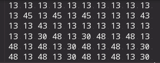

# 详细设计规约

### 1. 过程流设计

### 2. 日志结构

[Log Structure](https://github.com/XLab-Tongji/LogAnalysis/blob/master/Docs/Log-Structure.md)一文从以下五个角度研究了日志的组成结构：

- Who to log
- How to log
- Where to log
- What to log
- Whether to log

### 3. 算法设计

#### 3.1 聚类算法

##### 3.1.1 LogCluster

##### 3.1.2 Sequencer

##### 3.1.3 FT-tree

以下为FT-tree算法介绍，关于FT-tree的具体使用，注意事项等详见[FT-tree说明文档](https://github.com/XLab-Tongji/LogAnalysis/blob/master/Docs/Fttree.md)

1. 读取日志文件，将其存储在log_list变量中

2. 遍历log_list，找出所有日志类型，并构造索引表log_type_index（索引表只是为了加速计算）

3. 提取log_list中的detailed message存储在log_message中

4. 统计所有日志中所有单词及其出现次数，存储在字典word_support中，key为单词，value为频数

5. 将word_support根据value值进行排序，将排序结果存储在word_list中

6. 分别对每一种类型的日志计算其词频排序，并构造FT-tree

7. 根据k值对FT-tree进行减枝

8. 将聚类结果输出到指定文件中

   算法的具体实现难以概述，故结合下面案例对该算法进行较为清晰的介绍：

   

- 上图为读入的日志文件（部分），首先提取出Message type与Detailed meesage两个字段，如下图所示

  

- 统计所有日志中每个单词的出现频次，按大小排序，如上述日志中，单词出现频数排序如下：

  | changed | state | to   | Interface | Vlan-interface | down | up   | ae3  | ae1  | vlan22 | vlan20 |
  | ------- | ----- | ---- | --------- | -------------- | ---- | ---- | ---- | ---- | ------ | ------ |
  | 8       | 8     | 8    | 4         | 4              | 4    | 4    | 2    | 2    | 2      | 2      |

- 将所有日志按Message type分类，每一类对应一棵FT-tree，FT-tree根节点即为日志类型，如上述日志构造出两棵FT-tree，一颗根节点为SIF，另一棵根结点为OSPF

- 遍历每一条日志，根据上一步得到的词频排序表，对每条日志中的单词按词频顺序排列，并据此构造FT-tree

  如“Interface ae3, changed state to down”排序后变为：changed state to Interface down ae3

  构造的FT-tree为

  

  再遍历下一条同类型日志，不断对FT-tree作扩充：

  

- 根据阈值k，对FT-tree进行剪枝，如k等于5，则FT-tree包含根节点后最大深度为5+1=6，则深度大于6的结点都被舍弃

  

- 最后的FT-tree中有多少个叶子结点，就说明得到了多少种聚类，把所有Message Type对应的FT-tree聚类数相加即为聚类总数

- 最后将聚类结果与日志进行匹配，得到每一条日志的聚类类型

##### 3.1.4 Drain

##### 3.1.5 Louvain社区发现算法

Louvain社区发现算法是一种基于图论的聚类算法，Louvain算法思想如下，其具体说明详见[Louvain社区发现算法](https://github.com/XLab-Tongji/LogAnalysis/blob/master/Docs/Louvain-Algorithm.md):

- 1）将图中的每个节点看成一个独立的社区，次数社区的数目与节点个数相同；
- 2）对每个节点$i$，依次尝试把节点$i$分配到其每个邻居节点所在的社区，计算分配前与分配后的模块度变化$ΔQ$，并记录$ΔQ$最大的那个邻居节点，如果$maxΔQ>0$，则把节点i分配$ΔQ$最大的那个邻居节点所在的社区，否则保持不变；
- 3）重复2），直到所有节点的所属社区不再变化；
- 4）对图进行压缩，将所有在同一个社区的节点压缩成一个新节点，社区内节点之间的边的权重转化为新节点的环的权重，社区间的边权重转化为新节点间的边权重；
- 5）重复1）直到整个图的模块度不再发生变化。

#### 3.2 Model1：log key anomaly detection model算法设计

#### 3.3 Model2：parameter value anomaly detection model for each log key 算法设计

#### 3.4 Workflow算法设计

以下为Workflow算法介绍，关于Workflow的具体使用，注意事项等详见[Workflow说明文档](https://github.com/XLab-Tongji/LogAnalysis/blob/master/Docs/Workflow.md)

##### 3.4.1 将数据从文件读取到dataset中

对应函数为：

```python
def loadData(infile):
```

源数据文件为由字符串，空格与换行符构成的文本文件，需要将其处理为统一格式并存储在数组dataset中

如源数据文件为：



处理后得到的dataset为：


##### 3.4.2 构建data_tree

对应函数为：

```
def buildTree(window_size,type_num):
```

为了起到节省空间的目的，设计了一了class Node：

```python
class Node:
    def __init__(self,_base_pattern,_next_pattern,_next_frequency,_next_pattern3,_next_frequency3):
        self.base_pattern = _base_pattern          # 扫描dataset得到的长度为window_size所有模式
        self.next_pattern = _next_pattern          # 向后扫描一个长度得到的不同模式
        self.next_frequency = _next_frequency      # next_pattern中各模式出现的频数
        self.next_pattern3 = _next_pattern3        # 向后扫描三个长度得到的不同模式
        self.next_frequency3 = _next_frequency3    # next_pattern3中各模式出现的频数
```

data_tree则是由多个Node组成的一个列表。

比如我们的dataset为[1,2,3,3,3,1,2,3,1,2,3,3,2,2,1,3]，window_size=3

- ```
  data_tree[0].base_pattern=[1,2,3]
  data_tree[0].next_pattern=[1,3]
  data_tree[0].next_frequency=[1,2] #表示base[1,2,3]后出现1次数为1 出现3次数为2
  data_tree[0].next_pattern3=[[3,3,1],[1,2,3],[3,2,2]]
  data_tree[0].next_frequency3=[1,1,1] #表示[1,2,3]后出现上述三种魔术的次数都是1
  ```

- ```
  data_tree[1].base_pattern=[2,3,3]
  data_tree[1].next_pattern=[2,3]
  data_tree[1].next_frequency=[1,1] 
  data_tree[1].next_pattern3=[[3,1,2],[2,2,1]]
  data_tree[1].next_frequency3=[1,1] 
  ```

  依此类推构建出data_tree，使得data_tree列表中结点的base_pattern涵盖dataset中出现的所有长度为window_size的模式

  我们将会使用next_pattern3进行并发事件检查，使用next_pattern进行新任务检查

#####  3.4.3 检查并发事件

对应函数为：

```
def checkConcurrency(window_size,type_num):
```

在检查并发事件时，我们只考虑两个事件的并发检查，未进行多个事件的并发检查（只要考虑到多个事件并发出现的频率不高，且多事件并发检查效率较慢）。

遍历data_tree中每一个结点data_tree[i]:

	若data_tree[i]的next_pattern3为[[1,2,3],[3,2,4],[2,1,3]]，则[1,2,3]与[2,1,3]中的事件2与事件1就是一组并发事件，即存在j，k满足：

```
if (data_tree[i].next_pattern3[j][0] == data_tree[i].next_pattern3[k][1]) and \
        (data_tree[i].next_pattern3[j][1] == data_tree[i].next_pattern3[k][0]) and \
        (data_tree[i].next_pattern3[j][2] == data_tree[i].next_pattern3[k][2]):
```

则data_tree[i].next_pattern3[j]的第零个与第一个元素是一组并发事件。

将并发事件合并为一个新事件：如12 53为两个并发事件，则将其合并后的新事件为12053，计算方法为事件1*1000+事件2

##### 3.4.4 检查新任务

对应函数为：

```
def checkNewTask(window_size,type_num):
```

完成并发事件检查后，dataset发生了改变，所以在检查新任务之前，要重新构建data_tree（直接调用第3步的函数即可）

新任务检查需要使用data_tree结点中的next_pattern与next_frequency

假设data_tree[0].next_pattern=[1,2,3,4,5,6,7]，data_tree[0].next_frequency=[856,2,3,1,523,123,3]

很明显，1 5 6三个事件经常发生在该模式之后，而2 3 4 7四个事件就很少发生，这种情况，我就认为1 5 6是这段程序执行后的三个不同分支，而这段程序也可能是一个任务的终点（因为一个任务终止后，下一个事件就是另一个任务的起始事件，而新任务起始实践是不确定的，所以出现概率很低）。

所以对dataset中所有data_tree[0].base_pattern后跟随2 3 4 7的模式，在2 3 4 7前作截断。对dataset中所有data_tree[0].base_pattern后跟随1 5 6的模式，认为这是一个正常任务流，不做处理。

#####  3.4.5 输出，重构dataset

对应函数为：

```python
def outputDataset(infile):
```

检查出所有新任务起点后，将结果输出到命名格式为"new"+infilename+".txt"的文本文件中。每一行代表一个任务。

并构建new_dataset，new_dataset是一个二维列表，new_dataset[0]表示第一个任务中的所有事件流

##### 3.4.6 检查循环事件并输出最终结果

对应函数为：

```python
def checkCycle(infile):
```

最后遍历new_dataset，对每一个任务中的事件流进行循环事件检查。

如1 3 5 7 2 6 2 6 2 6 3 终2 6是一个循环单元，那么只保留一个循环单元，并将循环起始位置的数字设置为-2*1000-2，最终结果为1 3 5 7 -2002 3。具体算法为：只保留一个循环单元，并将循环起始位置数字$m$替换为$-1 \times m \times 1000 - n$，其中$n$为循环单元的长度。如5 -12004 5 6 2 1 2 则表示5  (12 5 6 2) 1 2括号中为循环部分。

然后将结果输出到命名格式为"new2"+infilename+".txt"的文本文件中。这就是我们程序的最终运行结果。