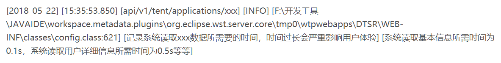
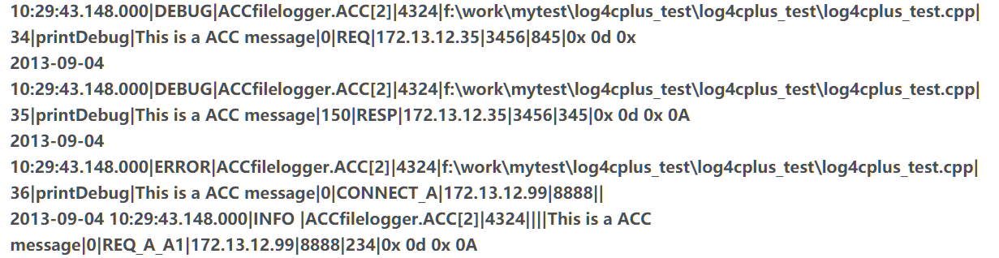
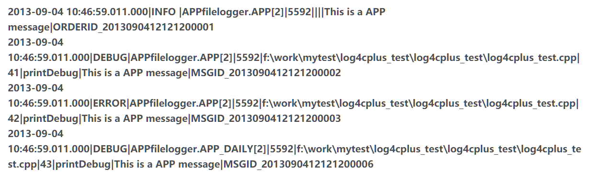
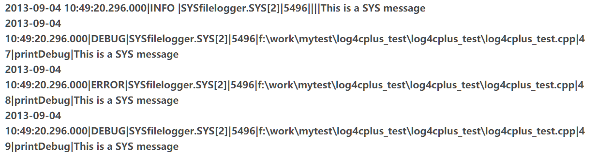

# 日志表示

### 1. Log级别 & Who to log

日志级别由高到低分别为fatal>error>warn>info>debug。低级别会输出高级别的信息，高级别不会输出低级别的信息。

- debug(trace):用来输出任何有利于在调试时更详细地了解系统状态的信息。有的系统有trace级别，trace相比于debug更细致地记录事件消息。
- info(successful、unsuccessful、failure):用来将系统必要的状态信息反馈给用户，突出强调应用程序运行时的状态。
- warn:用来输出系统中出现的不合理状态，这种不合理状态可通过修复而改变，若不修复系统也可正常运行。
- error:用来输出系统中出现的错误状态，这种错误状态可修复，若不修复则无法保证系统正常运行。
- fatal/critical/fatal error:严重错误，用来输出系统中无法修复的严重错误。

### 2. 日志表示方法 & How to log

#### 2.1 常用日志格式

- debug(trace):日期、时间、所属业务、日志级别、代码位置、日志内容

- info(successful、unsuccessful、failure):日期、时间、所属业务、日志级别、代码位置、记录内容说明、日志内容

- warn:日期、时间、所属业务、日志级别、代码位置、记录内容说明、日志内容

- error:日期、时间、所属业务、日志级别、代码位置、错误码、日志内容

- fatal/critical/fatal error:日期、时间、所属业务、日志级别、代码位置、错误概要、错误详情

- 例如：

  

#### 2.2 网络接受/应答日志

##### 2.2.1 日志标记

- RESP:表示收到对方的应答。

- REQ:表示请求外部服务。

- ACCEPT:表示接入一个新连接。

- CONNECT：表示向外部服务发起一个新连接。

- CLOSE：表示关闭一个连接。

- SHUNDOWN:表示切断一个连接。

##### 2.2.2 日志标记子
日志标记(RESP,REQ,CONNECT)里面的 RESP和REQ,CONNECT可以细化定义，增加子类型。因为一个网络服务有可能需要和A,B,C等不同的服务类别交互，该网络服务有可能既对外提供服务，也同时需要访问其他网络服务器的服务。比如访问A进程的A1和A2服务器的服务,分别可以这样定义：REQ_A_A1,RESP_A_A1;REQ_A_A2,RESP_A_A2

比如连接A进程:$CONNECT\_A$。

##### 2.2.3 具体格式

- 接收/应答时间

- 日志级别(DEBUG,INFO,WARN,ERROR,FATAL)

- 日志输出标记

- 线程标识

- 文件名称(DEBUG日志需要,非DEBUG日志可以为空)

- 文件行号(DEBUG日志需要,非DEBUG日志可以为空)

- 函数名称(DEBUG日志需要,非DEBUG日志可以为空)

- 日志描述

- 处理耗时(单位:毫秒),请求一般是零

- 日志标记(包括REQ,ACCEPT,RESP,CONNECT,CLOSE,SHUNDOMN几种大类型)

- 对方地址

- 对方端口

- 数据包长度

- 数据包内容（16进制）,如果内容太大，可以考虑只是打印一部分,多余部分用***表示。建议输出长度不要超过512字节，大于512字节的数据屏蔽输出。

  

#### 2.3 应用日志格式

- 发生时间

- 日志级别(DEBUG,INFO,WARN,ERROR,FATAL)

- 日志输出标记

- 线程标识

- 文件名称(DEBUG日志需要,非DEBUG日志可以为空)

- 文件行号(DEBUG日志需要,非DEBUG日志可以为空)

- 函数名称(DEBUG日志需要,非DEBUG日志可以为空)

- 日志描述

- 订单或者消息编号

  

#### 2.4 系统日志格式
- 发生时间

- 日志级别(DEBUG,INFO,WARN,ERROR,FATAL)

- 日志输出标记

- 线程标识

- 文件名称(DEBUG日志需要,非DEBUG日志可以为空)

- 文件行号(DEBUG日志需要,非DEBUG日志可以为空)

- 函数名称(DEBUG日志需要,非DEBUG日志可以为空)

- 日志描述

- 订单或者消息编号

  

#### 2.5 日志内容规范
对于“敏感”的单位信息，如名称、余额等信息，禁止使用debug以上级别的日志方法记录，在开发过程中，也应减少日志对该类信息的记录。一些敏感信息可以打马赛克后输出，比如比方字符串部分内容换成*。如：身份证号 422927198806031234,可以考虑这样输出: 42292719880*****34。对于特别敏感的交易信息，不能输出到日志文件。所有的异常（Exception）都必须写在日志中。

### 3. log分层
- 管理对象层
- 数据采集层
- 应用服务层
- 应用展现层

### 4. log分类
- 操作系统日志：可用于入侵检测，成功或者失败攻击通常会留下独特的痕迹，对事故的响应很有用
- 网络进程日志
- 应用程序日志
  - 应用程序用户活动
  - 特权用户日志
  - 关键的例行活动日志
  - 重新配置
- 网络基础设施日志:包括路由器、交换机和其他组成网络、将桌面和服务器绑定在一起的设备。
  - 登陆和注销
  - 建立服务连接
  - 出栈和入栈传输的字节数
  - 重新启动
  - 配置更改
- 安全主机日志:主机上运行的安全保护功能的主机日志。

### 5. what to log
打印的内容一定要从实际出发。也就是说如果在实际的生产环境中，你的用户量很大，日志在不停地刷新，如何定位某个用户的整个登录以及后续的操作呢？当然就是根据用户名来跟踪。所以打印内容的第一要素就是要能便于定位；定位过后也许用户在好几个模板中进行操作，还是定位，这个时候定的是模块的位；还有一点当然就是用户操作时的具体参数；最后一点就是用户干了什么。

### 6. where to log
#### 6.1 程序入口
在入口打印日志是因为这个时候传递进来的参数没有经过任何处理，将它打印在日志文件中能一眼就知道程序的原始数据是否符合我们的预期，是不是传递进来的原始数据就出现的问题。
#### 6.2 异常捕获
在异常打印出详细的日志能让你快速定位错误在哪里，例如在程序抛出异常捕获时，在平时我们经常就是直接在控制台打印出堆栈信息e.printStackTrace()，但在实际的生产环境更加艰苦，更别说有IDE来让你查看控制台信息，此时就需要我们将堆栈信息记录在日志中，以便发生异常时我们能准确定位程序在哪里出错。
#### 6.3 重要信息
这一点可能很宽泛，因为不同的业务逻辑重点可能并不一样，例如在有的重要参数不能为空，此时就需要判断是否为空，如果为空则记录到日志中；还有的例如传递进来的参数经过一系列的算法处理过后，此时也需要打印日志来查看是否计算正确。但切记，尽量不要直接在for循环中打印日志，特别是for循环特别大时，这样你的日志可能分分钟被冲得不见踪迹，甚至带来性能上的影响。

### 7. whether to log
日志系统往往会产生很多无用，冗余,重复的日志，因此从中我们需要考虑whether to log以减少不必要日志的输出。
#### 7.1 重复日志分类
- 同一个try里不同catch打了一模一样的日志文案
- 相同函数背景和相同文案，用了不同变量
- 内容和函数不统一
- 相似场景下，用了不同级别
- 相同方法的不同实现，用了重复日志
#### 7.2 Log2
Log2是微软开发的解决whether to log的系统。log2的原理其实就是在库内部维护两层可以动态调整的filter。第一层是针对每个函数的，根据历史数据评估这个函数的end-begin时间大致范围（主要就是是平均值方差了，这块量大，要高效），如果新执行的情况属于正常的，其实就可以不记录日志了。第二层是总的缓冲队列，根据队列状况(预定义阈值，比如1s钟最多刷1KB)，决定flush哪些日志到磁盘（使用增强学习算法做打分，判断队列里哪些日志对函数性能影响大，优先打哪些），以及给第一层过滤器发信号开启过滤。