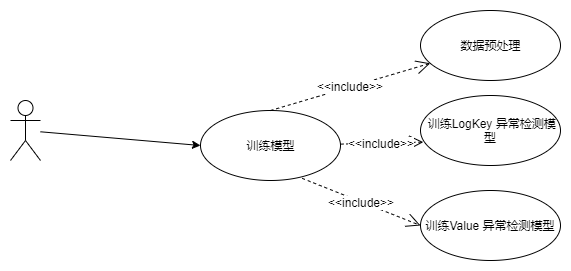
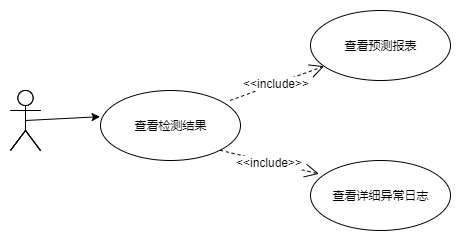

# 需求规约

## 项目介绍

### 项目背景

​	现代系统大规模发展，已经成为 IT 行业的核心部分，支持各种在线服务和智能应用。这些系统大多设计为全天候 24x7 运行，每小时就有约几百 GB（约120至2亿行）大量日志，在系统操作期间记录详细的运行时信息。

​	此外5G的出现，不仅伴随着数据传输速率的提高、延迟的减少以及设备连接的大规模化，同时也伴随着数据量的增多、微服务的增多等，由此将产生大量的日志数据，这些数据中记录了众多的5G设备运行信息，如何利用这些信息做到日志**异常诊断智能化**，对于5G时代系统的运维具有重要的意义。

​	系统发生故障前，其日志通常都具有许多特征反应出系统的异常状态，如果我们能提前发现系统异常，就能避免系统发生更严重的错误。然而在目前大多数系统中，管理员都是在系统出现故障之后，根据日志信息进行排错。这种事后检测会浪费大量的时间和精力，并且不一定能取得很好的效果。

​	传统的日志分析方法具有速度慢，鲁棒性差，难以适应大型系统等弊端，以迫切需要自动的、基于日志的系统异常检测方案。因此本项目使用**机器学习**方法来**自动化**学习，检测，定位日志中可能出现的异常。

### 项目目标

* 使用 机器学习 方法来**自动化**学习，检测，定位日志中可能出现的异常。

* 对产生异常的原因进行自动化分析，实现对异常的自动化**诊断**

  

### 目标人群

* 需要智能运维的大型企业及用户
* 从事智能运维，日志异常检测的研究人员

### 项目特色

​	本课题对日志分析与异常检测展开深入分析，并重点关注其在智能运维方面的使用场景。

​	首先，基于机器学习的日志异常检测在工业界目前应用不多，本课题研究有助于为日志分析与智能运维提供合适的技术解决方案；从横向上拓展了智能运维的领域宽度。

​	其次，本课题针对大量真实日志进行分析和检测，例如k8s，5G设备日志，有助于构建更加具备普适性的日志异常检测模型。对于日志异常检测的可靠性研究，方便相关研究人员的模型选择，确保异常检测模型的鲁棒性

## 项目需求分析

## 用例分析

### 概述

* 本系统参与者为 **用户** 。 

* 用户为本系统所提供服务的使用者

  * 用户可以直接使用系统所暴露的模型训练接口向后台传递一个训练日志文件，从而训练获得日志异常检测模型；
  * 用户可以直接使用系统所暴露的异常检测接口向后台传递一个待检测日志文件，使用训练的模型检测异常，并获得异常检测结果；
  * 系统返回的结果分为两部分，预测报表和预测详情。用户可以分别查看预测报表和预测详情，并进行判断与分析, 可选操作如下
    1. 分别查看总异常列表，模型一检测异常列表，模型二检测异常列表，来获取异常具体来源以及异常日志所处行数。
    2. 在文本框输入需要跳转的行数，来跳转到对应日志进行查看。
    3. 点击操作栏的上一条/下一条按钮，来跳转到上下一条异常日志，对具体异常日志进行查看。
  * 点击推送按钮，将异常检测结果推送至知识图谱分析端。
    ​

-----

### 系统用例总图

​                                                   

​										图1- 系统用例 总图

---

### 详述

​					                     

&nbsp;									 图2 -  上传训练文件 -  用例

​                         

### 用例: _上传训练文件_

#### 描述对象

* 上传训练文件

#### 标识符

* UC00

#### 说明

* 用户使用系统的网站上提供的接口上传训练文件, 
​       来训练获得异常检测模型

#### 参与者

* 用户

#### 频度

* 高

#### 状态

* 通过

#### 前置条件

* 网络连接成功
* 用户访问了我们的网站
* 用户上传文件大小不超过1mb，日志总数不超过10000行

#### 后置条件

* 用户所访问的我们网站的页面上显示了,文件上传成功
* 用户的目标应用进度条将显示上传文件已完成，并进入训练阶段

#### 被扩展的用例

* 无

#### 被包含的用例

* 无

#### 基本操作流程

  1. 用户点击上传训练文件按钮，界面将显示文件选择框
  2. 用户选择上传的文件
  3. 系统检测上传文件是否合法

    3.1 文件合法则显示成功上传
    3.2 文件不合法则给出错误信息

#### 可选操作流程

------

​                     

&nbsp;									 图2 -  训练模型 -  用例

### 用例: _训练模型_

#### 描述对象

* 训练模型

#### 标识符

* UC01

#### 说明

* 用户在上传训练文件后，使用系统的网站上提供的"训练模型接口"训练异常检测模型

#### 参与者

* 用户

#### 频度

* 高

#### 状态

* 通过

#### 前置条件

* 网络连接成功
* 用户访问了我们的网站
* 用户成功上传了训练文件

#### 后置条件

* 系统进入训练模型状态，进行数据预处理阶段
* 用户所访问的我们网站的页面上开始显示数据预处理进度

#### 被扩展的用例

* 无

#### 被包含的用例

* 数据预处理
* 训练logkey异常检测模型
* 训练Value 异常检测模型

#### 基本操作流程

  1. 在上传训练文件后，用户点击训练模型按钮
  2. 系统根据训练文件训练模型，并返回训练进度
        3. 用户查看训练进度，等待训练完成

#### 可选操作流程

* 无

-------

### 被包含用例: _数据预处理_

#### 描述对象

- 数据预处理

#### 标识符

- UC01

#### 说明

- 用户训练模型过程中，系统首先要对用户上传的预测文件进行预处理，包括日志清洗，日志聚类，提取log_key，提取日志value，用户可以实时查看处理进度

#### 参与者

- 用户

#### 频度

- 高

#### 状态

- 通过

#### 前置条件

- 网络连接成功
- 用户上传训练文件
- 用户开始训练模型

#### 后置条件

* 数据预处理进度条显示100% 已完成
* 开始训练logkey 异常检测模型

#### 被扩展的用例

- 无

#### 被包含的用例

- 无

#### 基本操作流程

1. 用户使用系统提供的“训练模型接口”开始训练模型
2. 系统进行日志清洗，日志聚类，提取logkey，提取value 四步骤，并返回数据预处理进度
3. 用户查看处理进度

#### 可选操作流程

- 无

-----
### 被包含用例: _训练logkey异常检测模型_

#### 描述对象

- 训练logkey异常检测模型

#### 标识符

- UC02

#### 说明

- 用户训练模型过程中，系统在对训练文件进行数据预处理之后，会根据提取得到的logkey训练logkey异常检测模型，用户可以实时查看训练进度

#### 参与者

- 用户

#### 频度

- 高

#### 状态

- 通过

#### 前置条件

- 网络连接成功
- 用户上传训练文件
- 用户开始训练模型
- 数据预处理已完成

#### 后置条件

* logke异常检测模型训练进度条显示100% 已完成
* 开始训练value异常检测模型

#### 被扩展的用例

- 无

#### 被包含的用例

- 无

#### 基本操作流程

1. 在数据预处理完成后，系统根据提取的logkey开始训练logkey异常检测模型，并返回训练进度
2. 用户查看训练进度

#### 可选操作流程

-----

### 被包含用例: _训练value异常检测模型_

#### 描述对象

- 训练value异常检测模型

#### 标识符

- UC03

#### 说明

- 用户训练模型过程中，系统在完成logkey异常检测模型训练之后，会根据数据预处理得到的日志value 训练value异常检测模型，用户可以实时查看训练进度

#### 参与者

- 用户

#### 频度

- 高

#### 状态

- 通过

#### 前置条件

- 网络连接成功
- 用户上传训练文件
- 用户开始训练模型
- 数据预处理已完成
- logkey异常检测模型训练完成

#### 后置条件

* value异常检测模型训练进度条显示100% 已完成
* 网页上步骤条训练模型显示完成，并进入下一步骤“上传预测文件”

#### 被扩展的用例

- 无

#### 被包含的用例

- 无

#### 基本操作流程

1. 在logkey异常检测模型训练后，系统开始训练value异常检测模型，并返回训练进度
2. 用户查看训练进度，并等待训练完成

#### 可选操作流程

-----
​					                     

&nbsp;									 图4 -  上传训练文件 -  用例

### 用例: _上传预测文件_

#### 描述对象

* 上传预测文件

#### 标识符

* UC04

#### 说明

* 用户使用系统的网站上提供的接口上传预测文件, 对日志进行异常检测

#### 参与者

* 用户

#### 频度

* 高

#### 状态

* 通过

#### 前置条件

* 网络连接成功
* 用户访问了我们的网站
* 用户模型训练已经完成

#### 后置条件

* 用户所访问的我们网站的页面上显示了,文件上传成功
* 网页进入异常检测阶段

#### 被扩展的用例

* 无

#### 被包含的用例

* 无
#### 基本操作流程

  1. 用户点击上传预测文件按钮，界面将显示文件选择框

  2. 用户选择上传的文件

  3. 系统检测上传文件是否合法：

  3.1 文件合法则显示成功上传

  3.2 文件不合法则给出错误信息

#### 可选操作流程
* 无

------

​					                    

&nbsp;									 图5 -  异常检测 -  用例

### 用例: _异常检测_

#### 描述对象

* 异常检测

#### 标识符

* UC05

#### 说明

* 用户在上传待检测文件后，使用系统的网站上提供的"异常检测"接口对日志进行检测

#### 参与者

* 用户

#### 频度

* 高

#### 状态

* 通过

#### 前置条件

* 网络连接成功
* 用户访问了我们的网站
* 用户模型训练已经完成
* 待预测文件成功上传

#### 后置条件

* 网页将跳转到预测详情页面，并显示具体的预测结果

#### 被扩展的用例

* 无

#### 被包含的用例

* 无
#### 基本操作流程

  1. 用户在上传预测文件后，点击异常检测按钮
  2. 系统对预测文件进行异常检测并返回检测结果

#### 可选操作流程
* 无

------
​					                    

&nbsp;									 图6 -  查看检测结果 -  用例

### 用例: _查看检测结果_

#### 描述对象

* 查看预测结果

#### 标识符

* UC06

#### 说明

* 用户在成功进行异常检测后，系统会生成异常检测报表和标注异常日志，用户可以分别进行查看

#### 参与者

* 用户

#### 频度

* 高

#### 状态

* 通过

#### 前置条件

* 网络连接成功
* 用户成功完成异常检测

#### 后置条件

* 无

#### 被扩展的用例

* 无

#### 被包含的用例

* 查看预测报表
* 查看详细异常日志

#### 基本操作流程

  1. 用户查看异常报表，对系统检测出来的异常进行整体概览
  2. 用户查看具体异常日志，详细查看日志异常情况

#### 可选操作流程
* 无

------
### 被包含用例: _查看检测报表_

#### 描述对象

* 查看检测报表

#### 标识符

 * UC07

#### 说明

* 用户异常检测后，系统会生成异常检测报表，对异常检测的结果进行概览和统计。用户可以进行查看

#### 参与者

* 用户

#### 频度

* 高

#### 状态

* 通过

#### 前置条件

* 网络连接成功
* 用户成功完成异常检测

#### 后置条件

* 无

#### 被扩展的用例

* 无

#### 被包含的用例

* 无

#### 基本操作流程

  1. 用户打开异常检测详情页面查看异常检测报表
  2. 用户查看检测时间，日志总数，异常总数，异常日志列表
  3. 用户查看logkey异常检测模型检测出来的异常日志列表
  4. 用户查看value异常检测模型检测出来的异常日志列表

#### 可选操作流程
* 无

----

### 被包含用例: _查看详细异常日志_

#### 描述对象

* 查看详细异常日志

#### 标识符

* UC08

#### 说明

* 用户异常检测后，前端会展示检测的日志，并标注出异常日志。用户可以进行查看

#### 参与者

* 用户

#### 频度

* 高

#### 状态

* 通过

#### 前置条件

* 网络连接成功
* 用户成功完成异常检测

#### 后置条件

* 无

#### 被扩展的用例

* 无

#### 被包含的用例

* 无

#### 基本操作流程

   1. 拖动竖向滚动条对日志进行遍历
   2. 拖动横向滚动条对日志进行仔细查看

#### 可选操作流程

*  在文本框输入需要跳转的行数，来跳转到对应日志进行查看
*  点击操作栏的上一条/下一条按钮，来跳转到上下一条异常日志，对具体异常日志进行查看
