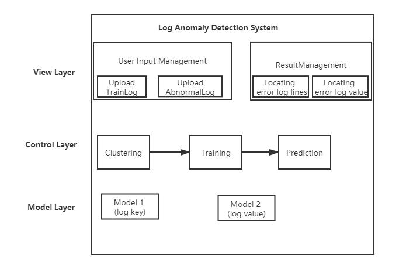
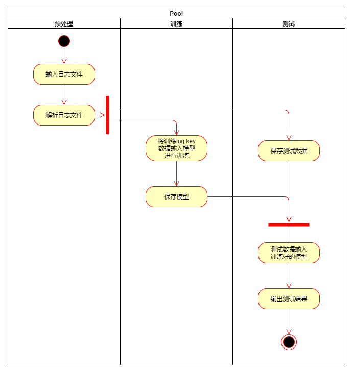
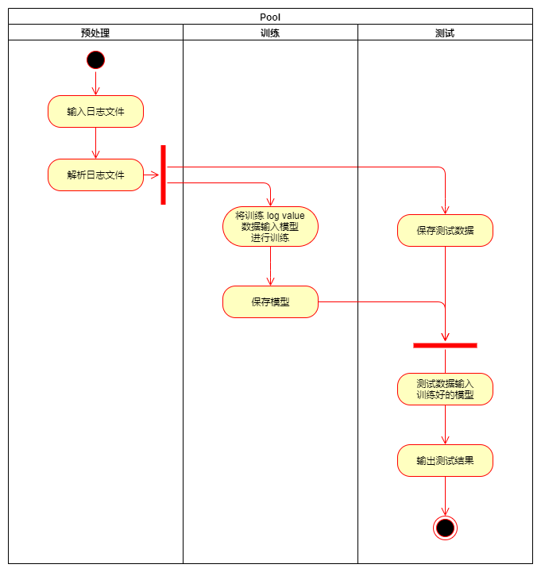
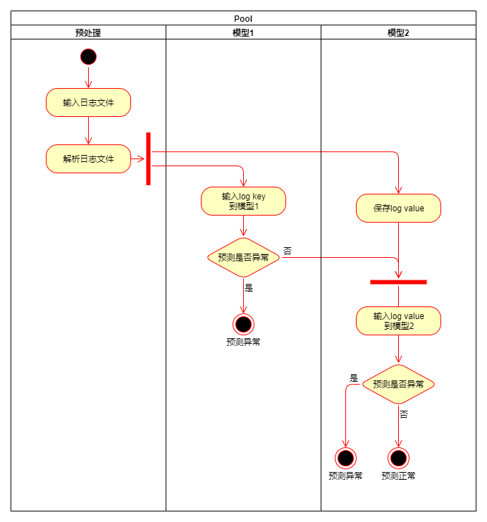
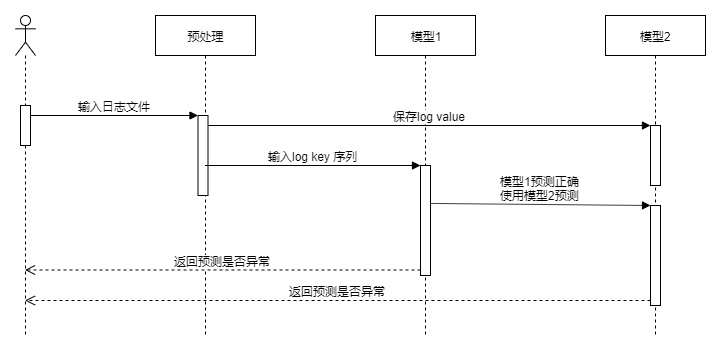
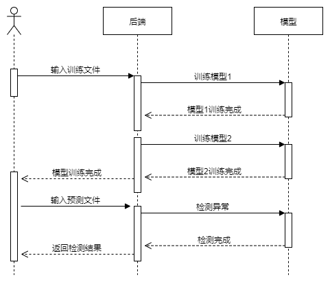

# 需求分析规约

## 引言

### 项目背景

现代系统大规模发展，已经成为 IT 行业的核心部分，支持各种在线服务和智能应用。这些系统大多设计为全天候 24x7 运行，每小时就有约几百 GB（约120至2亿行）大量日志，在系统操作期间记录详细的运行时信息。

此外5G的出现，不仅伴随着数据传输速率的提高、延迟的减少以及设备连接的大规模化，同时也伴随着数据量的增多、微服务的增多等，由此将产生大量的日志数据，这些数据中记录了众多的5G设备运行信息，如何利用这些信息做到日志**异常诊断智能化**，对于5G时代系统的运维具有重要的意义。

系统发生故障前，其日志通常都具有许多特征反应出系统的异常状态，如果我们能提前发现系统异常，就能避免系统发生更严重的错误。然而在目前大多数系统中，管理员都是在系统出现故障之后，根据日志信息进行排错。这种事后检测会浪费大量的时间和精力，并且不一定能取得很好的效果。

传统的日志分析方法具有速度慢，鲁棒性差，难以适应大型系统等弊端，以迫切需要自动的、基于日志的系统异常检测方案。因此本项目使用**机器学习**方法来**自动化**学习，检测，定位日志中可能出现的异常。

### 项目目标

* 使用机器学习方法来**自动化**学习，检测，定位日志中可能出现的异常。

* 对产生异常的原因进行自动化分析，实现对异常的自动化**诊断**

## 功能需求

### 系统范围

- 本项目使用机器学习方法来自动化学习，检测，定位日志中可能出现的异常；对研究结果进行分析与总结。

- 本系统包括前端和后端两个部分。前端主要用于与客户的交互和展示，客户可以在网页上传训练文件进行训练，训练完成后还可以上传预测文件对日志异常进行预测。而后端则对用户上传的文件进行训练和预测。

### 系统体系结构

### 系统总体流程

1. 用户上传训练文件
2. 用户点击训练开始训练
3. 后端对日志进行聚类
4. 后端提取日志 log key
5. 后端提取日志 log value（参数值向量）
6. 后端训练模型1
7. 后端训练模型2
8. 用户上传预测文件
9. 后端读取日志行，解析为 log key 和 log value（参数值向量）
10. 后端利用模型1检测 log key 是否异常
11. 若 log key 异常，则判断该行日志异常并继续第9步
12. 若 log key 正常，则利用模型2检测 log value 是否异常
13. 若 log value 正常，则判断该行日志正常并继续第9步
14. 若 log value 异常，则判断该行日志异常并继续第9步

### 需求分析

#### 功能建模

##### 1. 模型1的活动图

通过活动图展示模型1的训练和预测过程，可描述如下：

当日志文件输入后，预处理部分先解析日志，提取出 log key， 分为训练部分和测试部分。将训练部分用于模型1的训练，训练完成后保存模型。然后测试阶段使用之前保存的测试数据，输入之前保存的模型1中，得到测试结果并输出。

##### 2. 模型2的活动图

通过活动图展示模型2的训练和预测过程，可描述如下：

当日志文件输入后，预处理部分先解析日志，提取出 log value， 分为训练部分和测试部分。将训练部分用于模型1的训练，训练完成后保存模型。然后测试阶段使用之前保存的测试数据，输入之前保存的模型1中，得到测试结果并输出。

##### 3. 检测日志的活动图

通过活动图展示检测异常日志过程，可描述如下：

当日志文件输入后，预处理部分先解析日志，提取出 log key 和 log value，保存 log value。对于一条日志，首先用模型1对其 log key 进行检测，若模型1检测此日志异常，则判定这条日志异常；否则对该条日志的 log value 进行检测，若模型2检测此日志异常，则判定这条日志异常；否则认为这条日志正常。

##### 4. 用户检测日志异常的活动图

通过活动图展示用户检测日志异常过程，可描述如下：

用户上传训练文件后点击训练按钮，后端开始训练模型1和模型2。训练完成后，用户可以上传预测文件进行预测，后端对此文件进行预测，将结果发送前端。前端将预测的报表展示给用户，包括模型1和模型2预测出的异常。

#### 行为建模

##### 1. 检测日志的顺序图

##### 2. 用户检测日志异常的顺序图

## 非功能需求

### 性能要求

#### 时间特性要求

- 预测响应时间：由于我们是对日志流的检测，而日志流的产生速度非常快，所以我们对日志产生的日常需要及时响应。

#### 准确率要求

我们的的模型针对日志异常进行检测，故需要做到两点要求：

- 准确率：准确率需要高，即我们需要将日志中异常的部分准确地找出来。
- 误报率：在保证准确率高地同时要使误报率尽量低，否则将正确日志误报为异常将会给用户带来极大的困扰。

#### 输入输出要求

输入：

- 训练：训练阶段输入一个用于训练地日志文件，该文件中每一行都是一条日志。并且该日志中所有的日志都是正常的日志。
- 预测：预测阶段用户输入一个用于预测的日志文件，该文件中每一行都是一条日志文件，文件中有异常日志也有正常日志。

输出：

- 训练：训练阶段输出为两个模型，一个用于`log key`的预测，一个用于`log value`的预测。
- 预测：预测阶段输出为预测文件中的错误日志，包括模型一预测出的异常和模型二预测出的异常。

### 安全性要求

软件必须具有较高的安全性。因为日志中包含企业的敏感信息，我们必须保证日志不会泄露出去造成企业机密的泄露和企业的损失。

### 灵活性要求

- 可扩展性：日志预处理的方法有很多，同时用于异常检测的模型也有很多。我们需要对这些方法和模型进行评估，这就要求我们的软件可扩展性要强，可以支持扩展日志预处理方法和模型的结构等。
- 适应性：日志的种类繁多，我们的软件需要对各种各样的日志都有较好的效果。所以我们的模型需要有较广的适应性，从而可以用于多种不同的日志。

## 运行环境规定

### 前端要求

- node.js>=8.11.3

### 后端要求

* python>=3.6
* Flask==1.0.2
* Flask-Cors==3.0.6
* numpy==1.18.0
* scikit-learn==0.19.2
* scipy==1.1.0
* tensorboardX==1.9
* pytorch==1.2.0