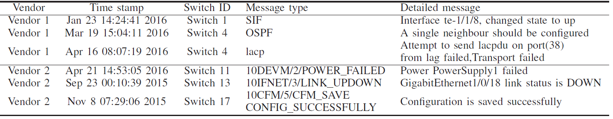
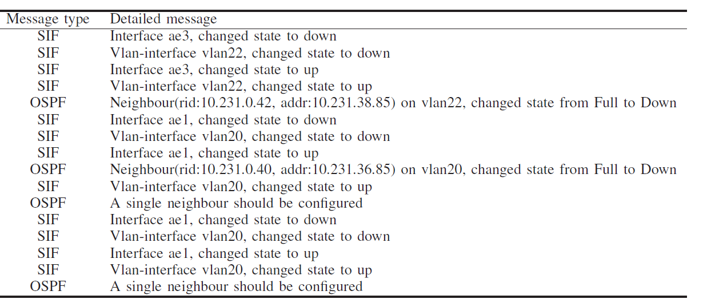
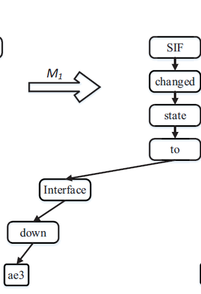

## FT-tree说明文档

###  简介

FT-tree是一种日志聚类算法，读入日志文件，将其作聚类后输出。

参考论文：Syslog Processing for Switch Failure Diagnosis and Prediction in Datacenter Networks

### 使用说明

直接运行根目录下fttree.py即可

参数说明：

- log_file_dir：待读取日志所在目录
- log_file_name：待读取日志文件名
- detailed_message_number：日志中Detailed message起始字段号
- message_type_number：日志中Message type所处字段号 若为-1 则表示无此字段 
- k：阈值，即生成的FT-tree的最大深度-1，理论上k越小，聚类结果越少，较大的k可能会导致聚类后的类别数极大

如下述日志文件，第0字段为月份，第1字段为日期，第2字段为时间，第3字段都是combo，第4字段可作为日志类型，第5字段为日志详细信息，则message_type_number可取4（也可令其为-1，即不设置日志类型），detailed_message_number应取为5。detailed_message_number与message_type_number应根据日志文件的特点灵活选取。

```
Jun 9 06:06:20 combo syslogd 1.4.1: restart.
Jun 9 06:06:20 combo syslog: syslogd startup succeeded
Jun 9 06:06:20 combo syslog: klogd startup succeeded
Jun 9 06:06:20 combo kernel: klogd 1.4.1, log source = /proc/kmsg started.
Jun 9 06:06:20 combo kernel: Linux version 2.6.5-1.358 (bhcompile@bugs.build.redhat.com) (gcc version 3.3.3 20040412 (Red Hat Linux 3.3.3-7)) #1 Sat May 8 09:04:50 EDT 2004
```

### 特别注意

因SYSLOG_293日志中第一行为总体说明，并非具体日志，因此该算法不读入第一行日志，把第二行作为第一条日志开始读入。

### 算法流程

1. 读取日志文件，将其存储在log_list变量中

2. 遍历log_list，找出所有日志类型，并构造索引表log_type_index（索引表只是为了加速计算）

3. 提取log_list中的detailed message存储在log_message中

4. 统计所有日志中所有单词及其出现次数，存储在字典word_support中，key为单词，value为频数

5. 将word_support根据value值进行排序，将排序结果存储在word_list中

6. 分别对每一种类型的日志计算其词频排序，并构造FT-tree

7. 根据k值对FT-tree进行减枝

8. 将聚类结果输出到指定文件中

   算法的具体实现难以概述，故结合下面案例对该算法进行较为清晰的介绍：

   

- 上图为读入的日志文件（部分），首先提取出Message type与Detailed meesage两个字段，如下图所示

  

- 统计所有日志中每个单词的出现频次，按大小排序，如上述日志中，单词出现频数排序如下：

  | changed | state | to   | Interface | Vlan-interface | down | up   | ae3  | ae1  | vlan22 | vlan20 |
  | ------- | ----- | ---- | --------- | -------------- | ---- | ---- | ---- | ---- | ------ | ------ |
  | 8       | 8     | 8    | 4         | 4              | 4    | 4    | 2    | 2    | 2      | 2      |

- 将所有日志按Message type分类，每一类对应一棵FT-tree，FT-tree根节点即为日志类型，如上述日志构造出两棵FT-tree，一颗根节点为SIF，另一棵根结点为OSPF

- 遍历每一条日志，根据上一步得到的词频排序表，对每条日志中的单词按词频顺序排列，并据此构造FT-tree

  如“Interface ae3, changed state to down”排序后变为：changed state to Interface down ae3

  构造的FT-tree为

  

  再遍历下一条同类型日志，不断对FT-tree作扩充：

  

- 根据阈值k，对FT-tree进行剪枝，如k等于5，则FT-tree包含根节点后最大深度为5+1=6，则深度大于6的结点都被舍弃

  

- 最后的FT-tree中有多少个叶子结点，就说明得到了多少种聚类，把所有Message Type对应的FT-tree聚类数相加即为聚类总数

- 最后将聚类结果与日志进行匹配，得到每一条日志的聚类类型

### 算法可能存在的问题

算法优点：

- 效率高：算法简单易懂，速度很快
- 稳定性：假设该算法处理三万条日志得到100种聚类结果，它在处理三十万条日志得到的聚类结果不会增加太多

#### 最主要问题

但是该算法存在许多问题，最为显著的问题在于该算法在处理某些类型的日志会有得到比较好的结果，但在处理一些其他类型，尤其是结构比较复杂的日志时效果很不理想。

该算法适用的日志应具有如下特点：

- 日志必须是结构化的(即按照统一要求生成的)

- 日志种有一个字段为Message type

- 同一Message type的日志的结果有一定规律性（结构化），

- Message type种类不宜过多。

  

  Data/LogFiles文件下的Apache.log  Linux.log Zookeeper.log属于该算法适用的日志类型

  以Apache.log(56482)为例，令message_type_number = 5 detailed_message_number = 6  k=3/4/5 得到的聚类数目都是30多种，比较理想

  Zookeeper.log(74380)，message_type_number = 2 detailed_message_number = 3 k=4 得到的聚类结果为52种 k=5聚类结果为96种

  

  但SYSLOG_293.LOG(22543)文件就是一个典型的反例，没有合适的Message type字段，且Detailed Message较为杂乱。

- 若无Message type，最终得到的聚类结果将比较粗略，准确性不会太高，聚类数目也可能会比较大。对SYSLOG_293.LOG文件进行测试时，令message_type_number = -1，k=2，得到的聚类结果为225种，k稍微取得大一些，聚类结果就会增长至上千种。

- 若Message type数目很多，最终得到的聚类数目将会很大。比如Message type有五十种，对每一种都构成一颗FT-tree，假设平均每棵FT-tree得到十种聚类，那么最终的聚类结果就会是500种。对SYSLOG_293.LOG文件进行测试时，若取detailed_message_number = 5，message_type_number = 4，k=2（这个阈值已经很小了，若k变大聚类数会变得更大），得到的聚类结果为8239种。

#### 次要问题

算法还存在一些次要性的问题，比如没有考虑近义词/反义词，只是单纯考虑词频。一对反义词很有可能应分在同一个模板中，但只要这对反义词词频足够高，该算法就会将它们划分在两个聚类中。

